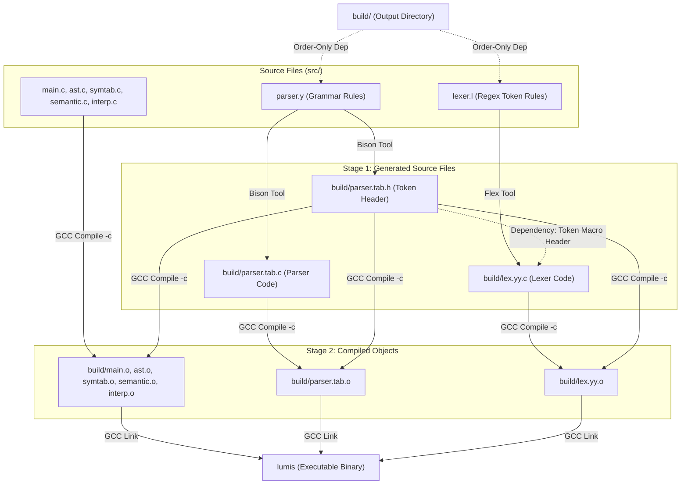

# Lumis Mini Compiler — Complete Makefile Build System Guide

This document explains the full build automation pipeline orchestrated by the [Makefile](file:///Users/mojahid/Codebase/lumis/Makefile) for the **Lumis Mini Compiler** project. 

---

## 1. High-Level Architecture & Compilation Flow

Building the compiler is not a simple single-command compilation because it involves generating C source code from parser and lexical specifications (`.y` and `.l` files) before compiling the static C source files.

The compilation process runs in three distinct stages:
1.  **Code Generation**: Bison processes [parser.y](file:///Users/mojahid/Codebase/lumis/src/parser.y) to generate the parser source/header, and Flex processes [lexer.l](file:///Users/mojahid/Codebase/lumis/src/lexer.l) to generate the scanner source.
2.  **Compilation**: All static and generated C source files are compiled into binary object files (`.o`) inside the `build/` directory.
3.  **Linking**: The object files are linked together to create the final executable binary `lumis`.



---

## 2. Walkthrough of Makefile Variables

The Makefile defines several key variables at the top of the file to configure compiler parameters and file paths:

```makefile
CC      = gcc
CFLAGS  = -Wall -g -std=c99 -D_POSIX_C_SOURCE=200809L -D_DEFAULT_SOURCE
LDFLAGS =
FLEX  = flex
BISON = bison
```
*   **`CC`**: Specifies the standard GNU C Compiler.
*   **`CFLAGS`**: Compilation options passed to the compiler:
    *   `-Wall`: Enables all compiler warning messages to facilitate debugging.
    *   `-g`: Produces debugging information needed for debugging tools (like GDB or LLDB).
    *   `-std=c99`: Forces adherence to the C99 standard.
    *   `-D_POSIX_C_SOURCE=200809L` and `-D_DEFAULT_SOURCE`: Feature test macros that unlock POSIX library additions (like `strdup` or `getline`) under standard compilation.
*   **`FLEX`** & **`BISON`**: Commands to invoke the respective lexical analyzer and parser generators.

### Suffix Substitution Rule
```makefile
SRCS  = $(SRC_DIR)/main.c $(SRC_DIR)/ast.c ...
OBJS  = $(SRCS:$(SRC_DIR)/%.c=$(BUILD_DIR)/%.o)
```
This is a pattern substitution rule. It tells `make` to look at every source file in `SRCS`, replace its prefix directory `src/` with `build/`, and replace its suffix `.c` with `.o`.
*   Example: `src/main.c` becomes `build/main.o`.

---

## 3. Step-by-Step Build Order Trace

When you execute `make` in the root workspace directory, the utility builds the target `all` (which defaults to the target `lumis`). Here is the chronological execution path:

### Step 1: Create Build Directory
```makefile
$(BUILD_DIR):
	mkdir -p $(BUILD_DIR)
```
*   **Command**: `mkdir -p build`
*   Creates the directory for intermediate files if it does not already exist.

### Step 2: Generate Parser Code (Bison)
```makefile
$(PARSER_C) $(PARSER_H): $(SRC_DIR)/parser.y | $(BUILD_DIR)
	$(BISON) -d -o $(PARSER_C) --defines=$(PARSER_H) $<
```
*   **Command**: `bison -d -o build/parser.tab.c --defines=build/parser.tab.h src/parser.y`
*   Takes the BNF grammar in [parser.y](file:///Users/mojahid/Codebase/lumis/src/parser.y).
*   Generates the parser code (`parser.tab.c`) and header file (`parser.tab.h`) containing structural token mappings (like `INT`, `FLOAT`, `IDENTIFIER`).
*   **Note**: The symbol `| $(BUILD_DIR)` represents an **order-only dependency**. It guarantees that the `build/` directory is created *before* Bison runs, but does not trigger Bison to run again if the directory modification timestamp updates.

### Step 3: Generate Lexer Code (Flex)
```makefile
$(LEXER_C): $(SRC_DIR)/lexer.l $(PARSER_H) | $(BUILD_DIR)
	$(FLEX) -o $@ $<
```
*   **Command**: `flex -o build/lex.yy.c src/lexer.l`
*   Uses [lexer.l](file:///Users/mojahid/Codebase/lumis/src/lexer.l) to generate `lex.yy.c`.
*   Specifies `$(PARSER_H)` as a dependency. This ensures that Bison has finished generating `parser.tab.h` first, which the scanner needs to include so that it understands token integer IDs returned to the parser.

### Step 4: Compile Compiler Object Files
```makefile
$(BUILD_DIR)/%.o: $(SRC_DIR)/%.c $(PARSER_H) | $(BUILD_DIR)
	$(CC) $(CFLAGS) -I$(BUILD_DIR) -I$(SRC_DIR) -c $< -o $@
```
*   **Command**: `gcc -Wall -g -std=c99 -D_POSIX_C_SOURCE=200809L -D_DEFAULT_SOURCE -Ibuild -Isrc -c src/<file>.c -o build/<file>.o`
*   Runs on each file in the source directory ([main.c](file:///Users/mojahid/Codebase/lumis/src/main.c), [ast.c](file:///Users/mojahid/Codebase/lumis/src/ast.c), [symtab.c](file:///Users/mojahid/Codebase/lumis/src/symtab.c), [semantic.c](file:///Users/mojahid/Codebase/lumis/src/semantic.c), and [interp.c](file:///Users/mojahid/Codebase/lumis/src/interp.c)).
*   Includes `-Ibuild` and `-Isrc` flags to allow `#include "parser.tab.h"` and local headers to resolve correctly.

### Step 5: Compile Generated Scanner & Parser Objects
```makefile
$(PARSER_OBJ): $(PARSER_C) $(PARSER_H) | $(BUILD_DIR)
	$(CC) $(CFLAGS) -I$(BUILD_DIR) -I$(SRC_DIR) -c $< -o $@

$(LEXER_OBJ): $(LEXER_C) $(PARSER_H) | $(BUILD_DIR)
	$(CC) $(CFLAGS) -I$(BUILD_DIR) -I$(SRC_DIR) -c $< -o $@
```
*   **Commands**:
    *   `gcc -Wall -g ... -c build/parser.tab.c -o build/parser.tab.o`
    *   `gcc -Wall -g ... -c build/lex.yy.c -o build/lex.yy.o`
*   Converts the Flex/Bison generated output source code into intermediate object files inside the `build/` folder.

### Step 6: Link Into Final Binary
```makefile
$(TARGET): $(OBJS) $(PARSER_OBJ) $(LEXER_OBJ)
	$(CC) $(CFLAGS) -o $@ $^ $(LDFLAGS)
```
*   **Command**: `gcc -Wall -g -std=c99 -D_POSIX_C_SOURCE=200809L -D_DEFAULT_SOURCE -o lumis build/main.o build/ast.o build/symtab.o build/semantic.o build/interp.o build/parser.tab.o build/lex.yy.o`
*   Combines the core compiler logic objects, parser object, and scanner object to create the executable binary `lumis`.

---

## 4. Targets & Interaction Commands

The Makefile defines three key target commands:

### `make` (Default target)
Compiles everything needed to generate the `lumis` executable.

### `make clean`
Removes all compiler outputs and cleans the workspace directories:
```bash
rm -rf build lumis
```

### `make test`
Executes automated tests:
1.  Makes sure the `lumis` compiler is up-to-date by triggering its dependency rules.
2.  Runs the compiled compiler binary against all valid files in the `tests/valid/` directory.
3.  Runs the compiler binary against invalid programs in `tests/invalid/` and expects compile/execution failures.
