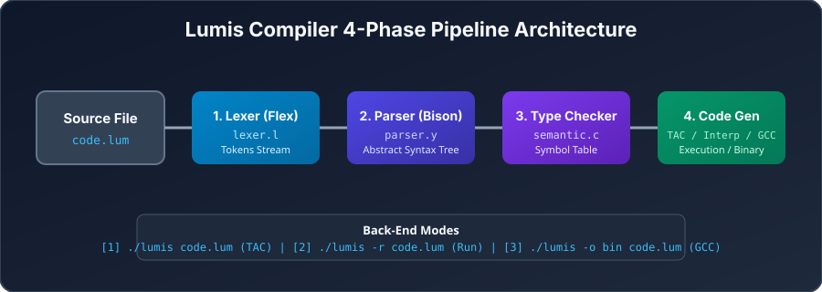

# 01. Lumis Compiler — Theoretical Overview & Architecture

Welcome to the **Lumis Compiler Design Guide**! This document provides a comprehensive, course-level introduction to compiler theory and explains how Lumis implements a classical 4-phase compiler pipeline.

---

## 1. What is a Compiler?

A **compiler** is a software system that translates source code written in a high-level programming language (such as Lumis `.lum` files) into a target representation (such as Three-Address Code, C source code, or machine code), while detecting lexical, syntactic, and semantic errors.

### Compiler Architecture: Front-End vs. Back-End

A modern compiler pipeline is divided into two main parts:

1. **Front-End (Language-Dependent)**:
   - **Lexical Analysis (Scanner)**: Converts character stream to token stream.
   - **Syntax Analysis (Parser)**: Verifies grammar and builds an Abstract Syntax Tree (AST).
   - **Semantic Analysis (Type Checker)**: Enforces scope, type, and declaration rules using a Symbol Table.

2. **Back-End (Machine-Dependent or IR-based)**:
   - **Intermediate Code Generation (IR / TAC)**: Emits machine-independent Three-Address Code.
   - **In-Memory AST Interpreter**: Executes statements directly for immediate output.
   - **C Code Generation & GCC Compiler Driver**: Emits valid C code and compiles native binaries.

<p align="center">
  
</p>

---

## 2. Theoretical Foundations (Compiler Design Course Mapping)

| Compiler Phase | Formal CS Concept | Tool / Source File in Lumis |
| -------------- | ----------------- | --------------------------- |
| **Lexical Analysis** | Regular Expressions, Nondeterministic/Deterministic Finite Automata (DFA) | Flex (`src/lexer.l`) |
| **Syntax Analysis** | Context-Free Grammars (CFG), Backus-Naur Form (BNF), LALR(1) Parsing | Bison (`src/parser.y`) |
| **AST Construction** | Syntax-Directed Translation (SDT), Abstract Syntax Trees | `src/ast.h`, `src/ast.c` |
| **Semantic Analysis** | Symbol Tables, Scope Chains, Type Systems & Promotion | `src/symtab.c`, `src/semantic.c` |
| **Code Generation** | Three-Address Code (TAC), Linear Quadruples/Triples | `src/codegen.c` |
| **Interpretation** | Tree-Walking Interpreter, Scope Environments | `src/interp.c` |
| **Target Compilation** | Target Code Generation, C Backend, Linker Driver | `src/c_backend.c` |

---

## 3. End-to-End Walkthrough of a Lumis Program

Consider the following Lumis code (`hello.lum`):

```c
int main() {
    int x = 10;
    int y = 20;
    int sum = x + y;
    print(sum);
    return 0;
}
```

### Phase 1: Lexical Analysis (Flex Scanner — `src/lexer.l`)
The lexer reads the character stream and converts it into a token stream:
- `int` $\rightarrow$ `INT`
- `main` $\rightarrow$ `ID("main")`
- `(` $\rightarrow$ `LPAREN`, `)` $\rightarrow$ `RPAREN`, `{` $\rightarrow$ `LBRACE`
- `int x = 10;` $\rightarrow$ `INT`, `ID("x")`, `ASSIGN`, `INT_NUM(10)`, `SEMI`
- `sum = x + y;` $\rightarrow$ `ID("sum")`, `ASSIGN`, `ID("x")`, `PLUS`, `ID("y")`, `SEMI`
- `print(sum);` $\rightarrow$ `PRINT`, `LPAREN`, `ID("sum")`, `RPAREN`, `SEMI`
- `return 0;` $\rightarrow$ `RETURN`, `INT_NUM(0)`, `SEMI`

### Phase 2: Syntax Analysis (Bison Parser — `src/parser.y`)
The parser matches the token sequence against Lumis BNF grammar rules using an LALR(1) parsing table and constructs the **AST**:

```text
Program
  FunctionDecl: main -> int
    Block
      VarDecl: x : int = 10
      VarDecl: y : int = 20
      VarDecl: sum : int = x + y
      PrintStmt
        VarRef: sum
      ReturnStmt
        Literal(int): 0
```

### Phase 3: Semantic Analysis & Symbol Table (`src/semantic.c` & `src/symtab.c`)
1. Creates `global` scope and registers function `main : int`.
2. Creates function scope `main` and registers symbols:
   - `x : SYM_VARIABLE, TYPE_INT`
   - `y : SYM_VARIABLE, TYPE_INT`
   - `sum : SYM_VARIABLE, TYPE_INT`
3. Checks that `x` and `y` are declared before referenced in `x + y`.
4. Verifies that `x + y` produces `TYPE_INT`, matching `sum`'s declared type.
5. Verifies `return 0;` matches function return type `int`.

### Phase 4: Back-End Modes

#### Mode 1: Three-Address Code (TAC Output — Default)
```text
FUNC main:
    x = 10
    y = 20
    t1 = x + y
    sum = t1
    PRINT sum
    RETURN 0
    END FUNC
```

#### Mode 2: In-Memory Interpreter Execution (`./lumis -r hello.lum`)
```text
=== PROGRAM EXECUTION ===
30
=========================
Program finished with exit code 0
```

#### Mode 3: Native Binary Generation (`./lumis -o hello hello.lum`)
Translates AST to C code, invokes `gcc`, and builds standalone executable `./hello`:
```bash
$ ./hello
30
```

---

## 4. Key Takeaways for Course Exams & Presentations

1. **Why use Flex and Bison?** Flex uses DFAs to generate an $O(n)$ scanner. Bison generates an LALR(1) parser that handles context-free grammars deterministically.
2. **Why use an AST instead of evaluating during parsing?** Separating parsing from execution allows multiple analysis passes (semantic checks, optimizations, multiple backend targets).
3. **What is Three-Address Code (TAC)?** An intermediate representation where instructions have at most 3 operands, making it machine-independent and easy to translate to machine instructions.
